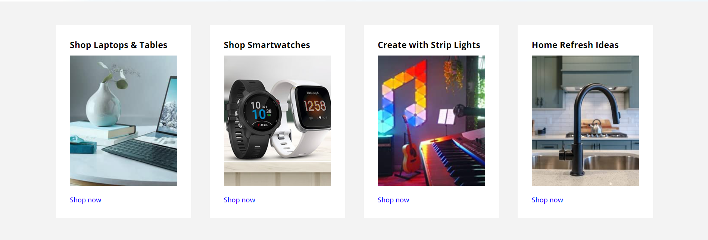
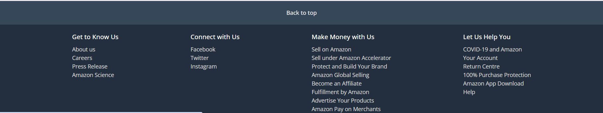

# Geekster Project

This project is a replica of an amazon website UI. It includes a responsive navigation bar, banner section, product listing, and footer.

[Check out our live site](http://example.com)

## Project Screenshots and Explanations

### 1. Navigation Bar

- **HTML Tags**:
  - <nav>: Defines the navigation bar container.
  -
: Used as containers for various sections like logo, address, search, etc.
  -<a>: Creates links for the logo, deliver address, location, sign-in, returns, orders, and cart.
  -: Displays the logo image.
  -: Used to include icons (like location and cart icons) and other inline elements.
  -<select>: Dropdown menu for search categories.
  -<option>: Defines the different options within the select dropdown.
  -<input>: Input field for the search bar.
  -
: Paragraph tags used for text like "Hello, sign in", "Returns", and "Cart".

- **CSS Properties**:
  -height: Defines the height of the navbar.
  -display: Sets the layout type, in this case, flex to arrange items in a row or column.
  -align-items: Aligns items vertically along the cross-axis (centered in this case).
  -justify-content: Aligns items horizontally along the main axis, ensuring space is evenly distributed.
  -cursor: Changes the cursor to a pointer when hovering over certain elements.
  -color: Sets the text color for elements within the navbar.
  -max-width: Defines the maximum width of the navbar and its elements to control their size.
  -margin: Adjusts the space around elements. For example, margin: 0 auto centers the navbar.
  -width: Defines the width of elements like the search input or logo.
  -margin-top: Adds spacing above elements, like the logo image.
  -font-size: Controls the size of the text within elements like "Sign in" and "Returns."
  -border-radius: Rounds the corners of elements like the search bar.
  -background: Sets the background color or image for elements like the search button.
  -text-align: Aligns text within elements, like centering the text in the dropdown.
  -border-top-left-radius: Rounds the top-left corner of an element.
  -border-bottom-left-radius: Rounds the bottom-left corner of an element.
  -border: Defines the border of elements (like the dropdown) with options like width and color.
  -outline: Removes or defines the outline around elements (e.g., search input) when focused.
  -padding-left: Adds padding to the left side of an element to create inner spacing.
  -font-weight: Sets the weight (thickness) of the text for emphasis, such as bold or normal.

### 2. Banner Section

- **HTML Tags**:
   -
: Used as containers for various sections like logo, address, search, etc.
   -: Used to include icons (like location and cart icons) and other inline elements.
   -<a>:Creates links for the "All" button, "Today's Deals," "Customer Service," "Registry," "Gift Cards," "Sell," and "Shop deals in Electronics."
   -<ul>:Defines an unordered list to hold the navigation links.
   -<li>:List items that contain each navigation link inside the unordered list.
  
- **CSS Properties**:
   -padding: Adds space inside the element, between its content and its border.
   -background: Sets the background color or image of the element.
   -color: Specifies the text color of the element.
   -font-size: Defines the size of the text.
   -margin: Sets the space outside the element, around its border.
   -max-width: Defines the maximum width of the element.
   -display: Specifies how the element should be displayed (e.g., flex for flexible layout).
   -align-items: Aligns items vertically within the container.
   -justify-content: Aligns items horizontally within the container.
   -gap: Defines the space between flex or grid items.
   -cursor: Specifies the type of cursor to be displayed when pointing over the element.
   -margin-right: Adds space to the right of the element.

### 3. Hero Section

- **HTML Tags**:
   -<section>:It helps in organizing the document into logical sections, each of which can be styled separately and have its own heading.

- **CSS Properties**:
   -height: Defines the height of the element.
   -background-image: Sets an image as the background of the element.
   -background-position: Specifies the position of the background image within the element (centered in this case).
   -background-size: Controls the size of the background image (covering the entire element).

### 4. Shop Section

- **HTML Tags**:
   -<section>: Defines a section of content, often used for grouping related elements.
   -
: A container used to group and style content, in this case, each shop-link and shop-images.
   -<h3>: Represents a heading, used for titles or section headings within each shop-link.
   -: Embeds an image, displaying product images in the shop-link sections.
   -<a>: Creates a hyperlink, used for "Shop now" links in each shop-link.
   -data-aos: Custom attribute used for AOS (Animate On Scroll) library to apply animations.

- **CSS Properties**:
   -display: Defines the layout type. Used to create a flex container for .shop-section and a grid container for .shop-images.
   -align-items: Aligns items along the cross-axis. In .shop-section, it centers items vertically.
   -flex-direction: Specifies the direction of flex items. In .shop-section, it's set to column to stack items vertically.
   -background-color: Sets the background color of elements. .shop-section has a light gray background.
   -padding: Adds space inside elements. .shop-section has padding on the top and bottom.
   -grid-template-columns: Defines the number and size of columns in a grid container. .shop-images uses a responsive grid with columns that adapt to the available space.
   -gap: Sets the space between grid items. .shop-images has a 40px gap between items.
   -max-width: Limits the maximum width of an element. .shop-images has a maximum width of 1280px.
   -width: Defines the width of an element. .shop-images is set to 100% of its container.
   -overflow: Controls the overflow of content. .shop-images hides any overflow content.
   -background-color: Sets the background color of .shop-link to white.
   -padding: Adds space inside .shop-link, making it visually distinct.
   -cursor: Changes the cursor type when hovering over .shop-link, indicating it’s clickable.
   -flex-direction: Sets the direction of flex items inside .shop-link to column, stacking them vertically.
   -white-space: Prevents text wrapping inside .shop-link.
   -transform: Applies a 2D or 3D transformation to elements. .shop-link scales to 1.1 times its size on hover.
   -transition: Defines the duration and easing function for property changes. .shop-link smoothly scales up on hover.
   -width: Sets the width of images inside .shop-link to 100% of their container.
   -height: Specifies the height of images. .shop-link img has a fixed height of 280px.
   -object-fit: Defines how an image should fit within its container. cover ensures the image covers the entire container.
   -margin-bottom: Adds space below elements. Adds spacing between the image and the heading in .shop-link.
   -font-size: Sets the font size. .shop-link a has a font size of 0.9rem.
   -color: Specifies the text color. .shop-link a is blue by default.
   -font-weight: Sets the thickness of the text. .shop-link a has a font weight of 500.
   -text-decoration: Controls the text decoration. .shop-link:hover a underlines the text on hover.

### 5. Footer Section

- **HTML Tags**:
   -<footer>: Defines the footer section of a webpage, typically containing information about the site or company.
   -<a>: Creates hyperlinks. In this context, it’s used for the "Back to top" link and the links within each section.
   -
: Serves as a container for grouping and styling other elements. In this case, it wraps around the footer items.
   -<ul>: Defines an unordered list. Each <ul> element contains a list of links organized under a specific heading.
   -<h3>: Represents a heading for each list section, providing a title for the grouped items.
   -<li>: Defines a list item. Each <li> element represents an individual link within the unordered list.
- **CSS Properties**:
   -display: flex;: Applies flexbox layout to arrange child elements in a row or column.
   -align-items: center;: Vertically centers items along the cross-axis in a flex container.
   -justify-content: center;: Horizontally centers items along the main axis in a flex container.
   -background-color: #37475a;: Sets the background color of the footer title area.
   -color: #fff;: Sets the text color to white.
   -font-size: 0.875rem;: Defines the font size of the text.
   -font-weight: 600;: Sets the font weight to bold.
   -height: 60px;: Defines the height of the footer title area.
   -background: #232f3e;: Sets the background color of the footer items section.
   -margin: 0 auto;: Centers the footer items section horizontally within its container.
   -width: 100%;: Ensures the footer items section takes up the full width of its container.
   -font-size: 1rem;: Defines the font size for the headings in the footer items section.
   -font-weight: 500;: Sets the font weight for headings in the footer items section.
   -margin: 20px 0 10px 0;: Adds margin above and below headings in the footer items section.
   -list-style: none;: Removes the default list styling (bullets) from unordered lists.
   -margin-bottom: 20px;: Adds space below each unordered list in the footer items section.
   -color: #ddd;: Sets the color of the links in the footer items section to a light gray.
   -text-decoration: underline;: Underlines the text of links when hovered over.
